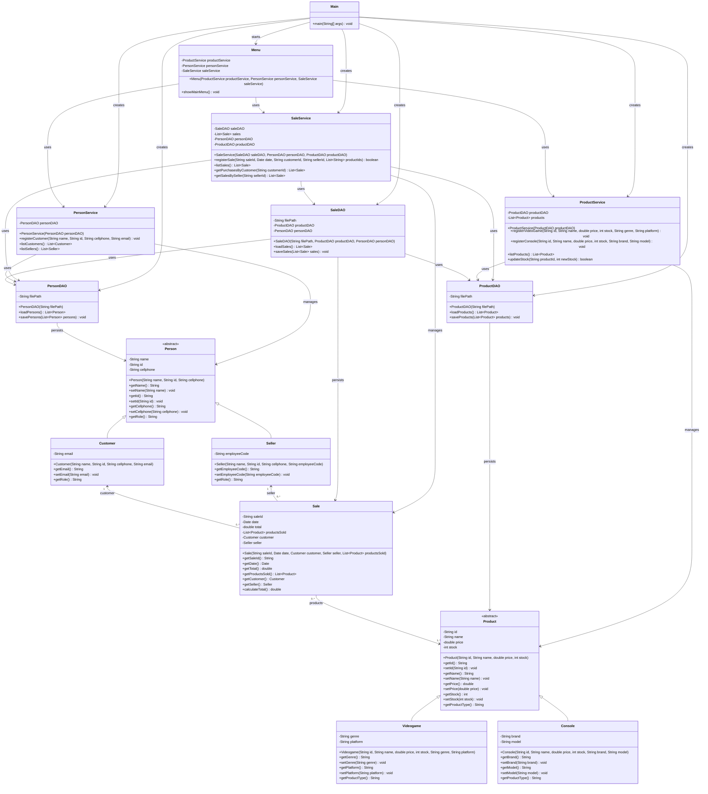

# Class Diagram

The following diagram represents the main classes, attributes, methods, inheritance relationships, associations, and multiplicities of the GameZone system.

```mermaid
classDiagram

    class Person {
        <<abstract>>
        -String name
        -String id
        -String cellphone
        +Person(String name, String id, String cellphone)
        +getName() String
        +setName(String name) void
        +getId() String
        +setId(String id) void
        +getCellphone() String
        +setCellphone(String cellphone) void
        +getRole() String
    }

    class Customer {
        -String email
        +Customer(String name, String id, String cellphone, String email)
        +getEmail() String
        +setEmail(String email) void
        +getRole() String
    }

    class Seller {
        -String employeeCode
        +Seller(String name, String id, String cellphone, String employeeCode)
        +getEmployeeCode() String
        +setEmployeeCode(String employeeCode) void
        +getRole() String
    }

    class Product {
        <<abstract>>
        -String id
        -String name
        -double price
        -int stock
        +Product(String id, String name, double price, int stock)
        +getId() String
        +setId(String id) void
        +getName() String
        +setName(String name) void
        +getPrice() double
        +setPrice(double price) void
        +getStock() int
        +setStock(int stock) void
        +getProductType() String
    }

    class Videogame {
        -String genre
        -String platform
        +Videogame(String id, String name, double price, int stock, String genre, String platform)
        +getGenre() String
        +setGenre(String genre) void
        +getPlatform() String
        +setPlatform(String platform) void
        +getProductType() String
    }

    class Console {
        -String brand
        -String model
        +Console(String id, String name, double price, int stock, String brand, String model)
        +getBrand() String
        +setBrand(String brand) void
        +getModel() String
        +setModel(String model) void
        +getProductType() String
    }

    class Sale {
        -String saleId
        -Date date
        -double total
        -List~Product~ productsSold
        -Customer customer
        -Seller seller
        +Sale(String saleId, Date date, Customer customer, Seller seller, List~Product~ productsSold)
        +getSaleId() String
        +getDate() Date
        +getTotal() double
        +getProductsSold() List~Product~
        +getCustomer() Customer
        +getSeller() Seller
        +calculateTotal() double
    }

    Person <|-- Customer
    Person <|-- Seller

    Product <|-- Videogame
    Product <|-- Console

    Customer "1" <-- "0..*" Sale : customer
    Seller "1" <-- "0..*" Sale : seller
    Sale "0..*" --> "1..*" Product : products

    class ProductDAO {
        -String filePath
        +ProductDAO(String filePath)
        +loadProducts() List~Product~
        +saveProducts(List~Product~ products) void
    }

    class PersonDAO {
        -String filePath
        +PersonDAO(String filePath)
        +loadPersons() List~Person~
        +savePersons(List~Person~ persons) void
    }

    class SaleDAO {
        -String filePath
        -ProductDAO productDAO
        -PersonDAO personDAO
        +SaleDAO(String filePath, ProductDAO productDAO, PersonDAO personDAO)
        +loadSales() List~Sale~
        +saveSales(List~Sale~ sales) void
    }

    ProductDAO --> Product : persists
    PersonDAO --> Person : persists
    SaleDAO --> Sale : persists
    SaleDAO --> ProductDAO : uses
    SaleDAO --> PersonDAO : uses

    class ProductService {
        -ProductDAO productDAO
        -List~Product~ products
        +ProductService(ProductDAO productDAO)
        +registerVideoGame(String id, String name, double price, int stock, String genre, String platform) void
        +registerConsole(String id, String name, double price, int stock, String brand, String model) void
        +listProducts() List~Product~
        +updateStock(String productId, int newStock) boolean
    }

    class PersonService {
        -PersonDAO personDAO
        +PersonService(PersonDAO personDAO)
        +registerCustomer(String name, String id, String cellphone, String email) void
        +listCustomers() List~Customer~
        +listSellers() List~Seller~
    }

    class SaleService {
        -SaleDAO saleDAO
        -List~Sale~ sales
        -PersonDAO personDAO
        -ProductDAO productDAO
        +SaleService(SaleDAO saleDAO, PersonDAO personDAO, ProductDAO productDAO)
        +registerSale(String saleId, Date date, String customerId, String sellerId, List~String~ productIds) boolean
        +listSales() List~Sale~
        +getPurchasesByCustomer(String customerId) List~Sale~
        +getSalesBySeller(String sellerId) List~Sale~
    }

    ProductService --> ProductDAO : uses
    ProductService --> Product : manages

    PersonService --> PersonDAO : uses
    PersonService --> Person : manages

    SaleService --> SaleDAO : uses
    SaleService --> PersonDAO : uses
    SaleService --> ProductDAO : uses
    SaleService --> Sale : manages

    class Menu {
        -ProductService productService
        -PersonService personService
        -SaleService saleService
        +Menu(ProductService productService, PersonService personService, SaleService saleService)
        +showMainMenu() void
    }

    class Main {
        +main(String[] args) void
    }

    Menu --> ProductService : uses
    Menu --> PersonService : uses
    Menu --> SaleService : uses

    Main --> ProductDAO : creates
    Main --> PersonDAO : creates
    Main --> SaleDAO : creates
    Main --> ProductService : creates
    Main --> PersonService : creates
    Main --> SaleService : creates
    Main --> Menu : starts

```
