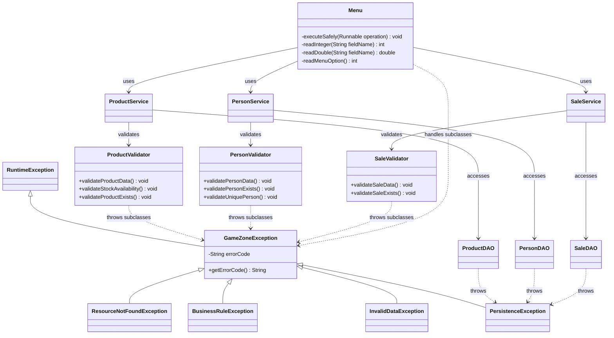

# Exception Handling Class Diagram

This diagram represents the custom exception hierarchy, validators, services, repositories, and console menu used in GameZone Unicesar.

```mermaid
classDiagram
    direction TB

    class RuntimeException

    class GameZoneException {
        -String errorCode
        +getErrorCode() String
    }

    class ResourceNotFoundException
    class BusinessRuleException
    class InvalidDataException
    class PersistenceException

    RuntimeException <|-- GameZoneException
    GameZoneException <|-- ResourceNotFoundException
    GameZoneException <|-- BusinessRuleException
    GameZoneException <|-- InvalidDataException
    GameZoneException <|-- PersistenceException

    class ProductValidator {
        +validateProductData() void
        +validateStockAvailability() void
        +validateProductExists() void
    }

    class PersonValidator {
        +validatePersonData() void
        +validatePersonExists() void
        +validateUniquePerson() void
    }

    class SaleValidator {
        +validateSaleData() void
        +validateSaleExists() void
    }

    class ProductService
    class PersonService
    class SaleService

    class ProductDAO
    class PersonDAO
    class SaleDAO

    class Menu {
        -executeSafely(Runnable operation) void
        -readInteger(String fieldName) int
        -readDouble(String fieldName) double
        -readMenuOption() int
    }

    Menu --> ProductService : uses
    Menu --> PersonService : uses
    Menu --> SaleService : uses

    ProductService --> ProductValidator : validates
    PersonService --> PersonValidator : validates
    SaleService --> SaleValidator : validates

    ProductService --> ProductDAO : accesses
    PersonService --> PersonDAO : accesses
    SaleService --> SaleDAO : accesses

    ProductValidator ..> GameZoneException : throws subclasses
    PersonValidator ..> GameZoneException : throws subclasses
    SaleValidator ..> GameZoneException : throws subclasses

    ProductDAO ..> PersistenceException : throws
    PersonDAO ..> PersistenceException : throws
    SaleDAO ..> PersistenceException : throws

    Menu ..> GameZoneException : handles subclasses
```
