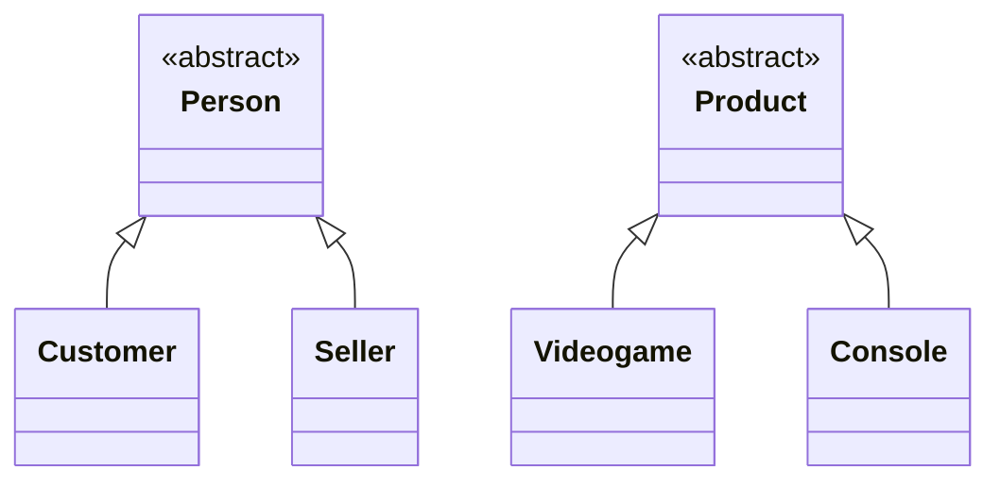

# Inheritance Hierarchy Diagram

The following diagram represents the inheritance hierarchies used in the GameZone system.

```mermaid
classDiagram

    class Person {
        <<abstract>>
    }

    class Customer
    class Seller

    Person <|-- Customer
    Person <|-- Seller

    class Product {
        <<abstract>>
    }

    class Videogame
    class Console

    Product <|-- Videogame
    Product <|-- Console
```
