# Integrated Class Diagram

The following diagram represents the main classes, inheritance relationships, associations, persistence components, services, and dependencies of the integrated GameZone system.

```mermaid
classDiagram

    %% =====================================================
    %% MODEL LAYER - PERSONS
    %% =====================================================

    class Person {
        <<abstract>>
        -String name
        -String id
        -String cellphone
        +Person(String name, String id, String cellphone)
        +getName() String
        +setName(String name) void
        +getId() String
        +setId(String id) void
        +getCellphone() String
        +setCellphone(String cellphone) void
        +getRole() String
    }

    class Customer {
        -String email
        +Customer(String name, String id, String cellphone, String email)
        +getEmail() String
        +setEmail(String email) void
        +getRole() String
    }

    class Seller {
        -String employeeCode
        +Seller(String name, String id, String cellphone, String employeeCode)
        +getEmployeeCode() String
        +setEmployeeCode(String employeeCode) void
        +getRole() String
    }

    Person <|-- Customer
    Person <|-- Seller


    %% =====================================================
    %% MODEL LAYER - PRODUCTS
    %% =====================================================

    class Product {
        <<abstract>>
        -String id
        -String name
        -double price
        -int stock
        +Product(String id, String name, double price, int stock)
        +getId() String
        +setId(String id) void
        +getName() String
        +setName(String name) void
        +getPrice() double
        +setPrice(double price) void
        +getStock() int
        +setStock(int stock) void
        +getProductType() String
    }

    class Videogame {
        -String genre
        -String platform
        +Videogame(String id, String name, double price, int stock, String genre, String platform)
        +getGenre() String
        +setGenre(String genre) void
        +getPlatform() String
        +setPlatform(String platform) void
        +getProductType() String
    }

    class Console {
        -String brand
        -String model
        +Console(String id, String name, double price, int stock, String brand, String model)
        +getBrand() String
        +setBrand(String brand) void
        +getModel() String
        +setModel(String model) void
        +getProductType() String
    }

    Product <|-- Videogame
    Product <|-- Console


    %% =====================================================
    %% MODEL LAYER - ACCESSORIES
    %% =====================================================

    class Accessory {
        <<abstract>>
    }

    class Controller
    class Cable
    class Memory

    Product <|-- Accessory
    Accessory <|-- Controller
    Accessory <|-- Cable
    Accessory <|-- Memory


    %% =====================================================
    %% MODEL LAYER - PROMOTIONS
    %% =====================================================

    class Promotion {
        <<abstract>>
        -String id
        -String name
        -LocalDate startDate
        -LocalDate endDate
        +isActive(LocalDate date) boolean
        +calculateDiscount(List~Product~ products) double
    }

    class PercentageDiscount {
        -double percentage
        +calculateDiscount(List~Product~ products) double
    }

    class CategoryDiscount {
        -double percentage
        -String category
        +calculateDiscount(List~Product~ products) double
    }

    class BulkPurchaseDiscount {
        -int minimumQuantity
        -double percentage
        +calculateDiscount(List~Product~ products) double
    }

    Promotion <|-- PercentageDiscount
    Promotion <|-- CategoryDiscount
    Promotion <|-- BulkPurchaseDiscount


    %% =====================================================
    %% MODEL LAYER - SALES
    %% =====================================================

    class Sale {
        -String saleId
        -Date date
        -double subtotal
        -double total
        -List~Product~ productsSold
        -Customer customer
        -Seller seller
        -String appliedPromotionName
        -double discountAmount
        -double extendedWarrantyCost
        +getSaleId() String
        +getDate() Date
        +getSubtotal() double
        +getTotal() double
        +getProductsSold() List~Product~
        +getCustomer() Customer
        +getSeller() Seller
        +getAppliedPromotionName() String
        +getDiscountAmount() double
        +getExtendedWarrantyCost() double
        +calculateSubtotal() double
        +calculateTotal() double
        +calculateFinalTotal() double
        +generateReceipt() String
        +canBeReturned() boolean
    }

    Customer "1" <-- "0..*" Sale : customer
    Seller "1" <-- "0..*" Sale : seller
    Sale "0..*" --> "1..*" Product : items
    Sale --> Promotion : applies


    %% =====================================================
    %% MODEL LAYER - WARRANTIES
    %% =====================================================

    class Warranty {
        <<abstract>>
        -String warrantyId
        -Product product
        -Sale sale
        -LocalDate startDate
        +getWarrantyId() String
        +getProduct() Product
        +getSale() Sale
        +getStartDate() LocalDate
        +getDurationInMonths() int
        +getWarrantyType() String
    }

    class BasicWarranty {
        +getDurationInMonths() int
        +getWarrantyType() String
    }

    class ExtendedWarranty {
        +getDurationInMonths() int
        +getWarrantyType() String
        +getAdditionalCost() double
    }

    Warranty <|-- BasicWarranty
    Warranty <|-- ExtendedWarranty

    Warranty --> Product : covers
    Warranty --> Sale : belongs to


    %% =====================================================
    %% MODEL LAYER - RETURNS
    %% =====================================================

    class Return {
        -String returnId
        -LocalDate returnDate
        -Sale originalSale
        -List~Product~ returnedProducts
        -String reason
        -double refundAmount
        -double warrantyRefundAmount
        +getReturnId() String
        +getReturnDate() LocalDate
        +getOriginalSale() Sale
        +getReturnedProducts() List~Product~
        +getReason() String
        +getRefundAmount() double
        +getWarrantyRefundAmount() double
        +setWarrantyRefundAmount(double warrantyRefundAmount) void
        +calculateRefundAmount() double
        +generateReturnReceipt() String
    }

    Return --> Sale : original sale
    Return --> Product : returned items


    %% =====================================================
    %% PERSISTENCE LAYER
    %% =====================================================

    class ProductDAO {
        -String filePath
        +ProductDAO(String filePath)
        +loadProducts() List~Product~
        +saveProducts(List~Product~ products) void
    }

    class PersonDAO {
        -String filePath
        +PersonDAO(String filePath)
        +loadPersons() List~Person~
        +savePersons(List~Person~ persons) void
    }

    class SaleDAO {
        -String filePath
        -ProductDAO productDAO
        -PersonDAO personDAO
        -AccessoryRepository accessoryRepository
        +loadSales() List~Sale~
        +saveSales(List~Sale~ sales) void
    }

    class PromotionDAO {
        -String filePath
        +loadPromotions() List~Promotion~
        +savePromotions(List~Promotion~ promotions) void
    }

    class ReturnDAO {
        -String filePath
        -SaleDAO saleDAO
        -ProductDAO productDAO
        -AccessoryRepository accessoryRepository
        +loadAll() List~Return~
        +saveAll(List~Return~ returns) void
    }

    class WarrantyDAO {
        -String filePath
        +loadAll() List~WarrantyRecord~
        +saveAll(List~Warranty~ warranties) void
    }

    class AccessoryRepository {
        +findAll() List~Accessory~
        +saveAll(List~Accessory~ accessories) void
    }

    ProductDAO --> Product : persists
    PersonDAO --> Person : persists

    SaleDAO --> Sale : persists
    SaleDAO --> ProductDAO : uses
    SaleDAO --> PersonDAO : uses
    SaleDAO --> AccessoryRepository : uses

    PromotionDAO --> Promotion : persists

    ReturnDAO --> Return : persists
    ReturnDAO --> SaleDAO : uses
    ReturnDAO --> ProductDAO : uses
    ReturnDAO --> AccessoryRepository : uses

    WarrantyDAO --> Warranty : persists

    AccessoryRepository --> Accessory : persists


    %% =====================================================
    %% SERVICE LAYER
    %% =====================================================

    class ProductService {
        -ProductDAO productDAO
        -List~Product~ products
        +registerVideoGame(...) void
        +registerConsole(...) void
        +listProducts() List~Product~
        +findProductById(String productId) Product
        +updateStock(String productId, int newStock) boolean
        +restoreStock(String productId, int quantity) boolean
    }

    class PersonService {
        -PersonDAO personDAO
        +registerCustomer(...) void
        +listCustomers() List~Customer~
        +listSellers() List~Seller~
    }

    class AccessoryService {
        -AccessoryRepository accessoryRepository
        +restoreStock(String accessoryId, int quantity) boolean
    }

    class PromotionService {
        -PromotionDAO promotionDAO
        +listPromotions() List~Promotion~
        +listActivePromotions() List~Promotion~
    }

    class WarrantyService {
        -WarrantyDAO warrantyDAO
        -SaleDAO saleDAO
        -ProductService productService
        -List~Warranty~ warranties
        +assignBasicWarranty(Product product, Sale sale) Warranty
        +assignExtendedWarranty(Product product, Sale sale) Warranty
        +findWarrantyByProduct(String productId) Warranty
        +listAll() List~Warranty~
        +listActive() List~Warranty~
        +listExpiring(int days) List~Warranty~
        +cancelWarranties(String productId, String saleId) double
    }

    class SaleService {
        -SaleDAO saleDAO
        -PersonDAO personDAO
        -ProductDAO productDAO
        -AccessoryService accessoryService
        -PromotionService promotionService
        -WarrantyService warrantyService
        -List~Sale~ sales
        +registerSale(...) boolean
        +listSales() List~Sale~
        +findSaleById(String saleId) Sale
        +getPurchasesByCustomer(String customerId) List~Sale~
        +getSalesBySeller(String sellerId) List~Sale~
    }

    class ReturnService {
        -ReturnDAO returnDAO
        -SaleService saleService
        -ProductService productService
        -AccessoryService accessoryService
        -WarrantyService warrantyService
        -List~Return~ returns
        +registerReturn(String saleId, List~String~ productIds, String reason) Return
        +viewAllReturns() List~Return~
        +viewReturnsByCustomer(String customerId) List~Return~
        +viewReturnsBySale(String saleId) List~Return~
        +calculateMonthlySales(int month, int year) double
        +calculateMonthlyReturns(int month, int year) double
        +generateMonthlyBalance(int month, int year) double
    }

    ProductService --> ProductDAO : uses
    ProductService --> Product : manages

    PersonService --> PersonDAO : uses
    PersonService --> Person : manages

    AccessoryService --> AccessoryRepository : uses
    AccessoryService --> Accessory : manages

    PromotionService --> PromotionDAO : uses
    PromotionService --> Promotion : manages

    WarrantyService --> WarrantyDAO : uses
    WarrantyService --> SaleDAO : resolves sales
    WarrantyService --> ProductService : resolves products
    WarrantyService --> Warranty : manages

    SaleService --> SaleDAO : uses
    SaleService --> PersonDAO : uses
    SaleService --> ProductDAO : uses
    SaleService --> AccessoryService : manages accessories
    SaleService --> PromotionService : evaluates promotions
    SaleService --> WarrantyService : assigns warranties
    SaleService --> Sale : manages

    ReturnService --> ReturnDAO : uses
    ReturnService --> SaleService : finds original sale
    ReturnService --> ProductService : restores product stock
    ReturnService --> AccessoryService : restores accessory stock
    ReturnService --> WarrantyService : cancels warranties
    ReturnService --> Return : manages


    %% =====================================================
    %% USER INTERFACE
    %% =====================================================

    class Menu {
        -ProductService productService
        -PersonService personService
        -SaleService saleService
        -AccessoryService accessoryService
        -PromotionService promotionService
        -ReturnService returnService
        -WarrantyService warrantyService
        +showMainMenu() void
    }

    class Main {
        +main(String[] args) void
    }

    Menu --> ProductService : uses
    Menu --> PersonService : uses
    Menu --> SaleService : uses
    Menu --> AccessoryService : uses
    Menu --> PromotionService : uses
    Menu --> ReturnService : uses
    Menu --> WarrantyService : uses

    Main --> ProductDAO : creates
    Main --> PersonDAO : creates
    Main --> SaleDAO : creates
    Main --> PromotionDAO : creates
    Main --> ReturnDAO : creates
    Main --> WarrantyDAO : creates
    Main --> AccessoryRepository : creates

    Main --> ProductService : creates
    Main --> PersonService : creates
    Main --> SaleService : creates
    Main --> AccessoryService : creates
    Main --> PromotionService : creates
    Main --> ReturnService : creates
    Main --> WarrantyService : creates

    Main --> Menu : starts
```

