# Layers Diagram

The following diagram represents the integrated layered architecture of the GameZone application and the dependencies between its main components.

The application separates domain entities, persistence operations, business logic, and user interaction into independent layers.

```mermaid
flowchart TD

    %% =====================================================
    %% USER INTERFACE LAYER
    %% =====================================================

    subgraph UI["User Interface Layer"]
        Main["Main"]
        Menu["Menu"]
    end

    %% =====================================================
    %% SERVICE LAYER
    %% =====================================================

    subgraph SERVICE["Service Layer"]
        ProductService["ProductService"]
        PersonService["PersonService"]
        SaleService["SaleService"]
        AccessoryService["AccessoryService"]
        PromotionService["PromotionService"]
        ReturnService["ReturnService"]
        WarrantyService["WarrantyService"]
    end

    %% =====================================================
    %% PERSISTENCE LAYER
    %% =====================================================

    subgraph PERSISTENCE["Persistence Layer"]
        ProductDAO["ProductDAO"]
        PersonDAO["PersonDAO"]
        SaleDAO["SaleDAO"]
        PromotionDAO["PromotionDAO"]
        ReturnDAO["ReturnDAO"]
        WarrantyDAO["WarrantyDAO"]
        AccessoryRepository["AccessoryRepository"]
    end

    %% =====================================================
    %% MODEL LAYER
    %% =====================================================

    subgraph MODEL["Model Layer"]

        Product["Product"]
        Videogame["Videogame"]
        Console["Console"]

        Accessory["Accessory"]
        Controller["Controller"]
        Cable["Cable"]
        Memory["Memory"]

        Person["Person"]
        Customer["Customer"]
        Seller["Seller"]

        Sale["Sale"]

        Promotion["Promotion"]
        PercentageDiscount["PercentageDiscount"]
        CategoryDiscount["CategoryDiscount"]
        BulkPurchaseDiscount["BulkPurchaseDiscount"]

        Return["Return"]

        Warranty["Warranty"]
        BasicWarranty["BasicWarranty"]
        ExtendedWarranty["ExtendedWarranty"]

    end

    %% =====================================================
    %% UI DEPENDENCIES
    %% =====================================================

    Main --> Menu

    Menu --> ProductService
    Menu --> PersonService
    Menu --> SaleService
    Menu --> AccessoryService
    Menu --> PromotionService
    Menu --> ReturnService
    Menu --> WarrantyService

    %% =====================================================
    %% MAIN INITIALIZATION
    %% =====================================================

    Main --> ProductService
    Main --> PersonService
    Main --> SaleService
    Main --> AccessoryService
    Main --> PromotionService
    Main --> ReturnService
    Main --> WarrantyService

    Main --> ProductDAO
    Main --> PersonDAO
    Main --> SaleDAO
    Main --> PromotionDAO
    Main --> ReturnDAO
    Main --> WarrantyDAO
    Main --> AccessoryRepository

    %% =====================================================
    %% SERVICE TO PERSISTENCE
    %% =====================================================

    ProductService --> ProductDAO
    PersonService --> PersonDAO
    AccessoryService --> AccessoryRepository
    PromotionService --> PromotionDAO
    SaleService --> SaleDAO
    ReturnService --> ReturnDAO
    WarrantyService --> WarrantyDAO

    %% =====================================================
    %% SERVICE INTEGRATION
    %% =====================================================

    SaleService --> AccessoryService
    SaleService --> PromotionService
    SaleService --> WarrantyService

    ReturnService --> SaleService
    ReturnService --> ProductService
    ReturnService --> AccessoryService
    ReturnService --> WarrantyService

    WarrantyService --> ProductService
    WarrantyService --> SaleDAO

    %% =====================================================
    %% PERSISTENCE DEPENDENCIES
    %% =====================================================

    SaleDAO --> ProductDAO
    SaleDAO --> PersonDAO
    SaleDAO --> AccessoryRepository

    ReturnDAO --> SaleDAO
    ReturnDAO --> ProductDAO
    ReturnDAO --> AccessoryRepository

    %% =====================================================
    %% PERSISTENCE TO MODEL
    %% =====================================================

    ProductDAO --> Product
    PersonDAO --> Person
    SaleDAO --> Sale
    PromotionDAO --> Promotion
    ReturnDAO --> Return
    WarrantyDAO --> Warranty
    AccessoryRepository --> Accessory

    %% =====================================================
    %% SERVICE TO MODEL
    %% =====================================================

    ProductService --> Product
    PersonService --> Person
    AccessoryService --> Accessory
    PromotionService --> Promotion
    SaleService --> Sale
    ReturnService --> Return
    WarrantyService --> Warranty

    %% =====================================================
    %% MODEL RELATIONSHIPS
    %% =====================================================

    Product --> Videogame
    Product --> Console
    Product --> Accessory

    Accessory --> Controller
    Accessory --> Cable
    Accessory --> Memory

    Person --> Customer
    Person --> Seller

    Promotion --> PercentageDiscount
    Promotion --> CategoryDiscount
    Promotion --> BulkPurchaseDiscount

    Warranty --> BasicWarranty
    Warranty --> ExtendedWarranty

    Sale --> Product
    Sale --> Customer
    Sale --> Seller
    Sale --> Promotion

    Return --> Sale
    Return --> Product

    Warranty --> Product
    Warranty --> Sale
```

## Layer Responsibilities

### User Interface Layer

The User Interface Layer manages interaction with the user.

`Menu` provides access to product, person, sale, accessory, promotion, return, and warranty operations.

`Main` initializes the persistence and service components and injects the required dependencies before starting the application.

### Service Layer

The Service Layer contains the business logic of the application.

- `ProductService` manages videogames, consoles, and product inventory.
- `PersonService` manages customers and sellers.
- `AccessoryService` manages accessories and accessory inventory.
- `PromotionService` manages promotions and discount evaluation.
- `SaleService` coordinates the complete sale registration process.
- `ReturnService` manages returns, refunds, inventory restoration, warranty cancellation, and monthly reports.
- `WarrantyService` manages warranty assignment, queries, and cancellation.

### Persistence Layer

The Persistence Layer stores and retrieves application data using text and CSV files.

Most modules use DAO classes:

- `ProductDAO`
- `PersonDAO`
- `SaleDAO`
- `PromotionDAO`
- `ReturnDAO`
- `WarrantyDAO`

The Accessory module uses `AccessoryRepository` for its persistence operations.

### Model Layer

The Model Layer contains the domain entities of the GameZone system.

It includes the product, person, accessory, sale, promotion, return, and warranty hierarchies.

The model classes represent the application data and domain behavior without directly managing file persistence.