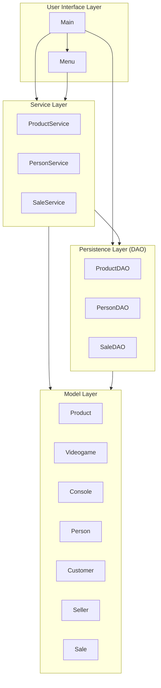

# Layers Diagram

The following diagram represents the organization of the GameZone application into its main layers and the dependencies between them.

```mermaid
flowchart TD

    subgraph UI["User Interface Layer"]
        Main
        Menu
    end

    subgraph SERVICE["Service Layer"]
        ProductService
        PersonService
        SaleService
    end

    subgraph DAO["Persistence Layer (DAO)"]
        ProductDAO
        PersonDAO
        SaleDAO
    end

    subgraph MODEL["Model Layer"]
        Product
        Videogame
        Console
        Person
        Customer
        Seller
        Sale
    end

    Main --> Menu
    Main --> SERVICE
    Main --> DAO

    Menu --> SERVICE

    SERVICE --> DAO
    SERVICE --> MODEL

    DAO --> MODEL
```