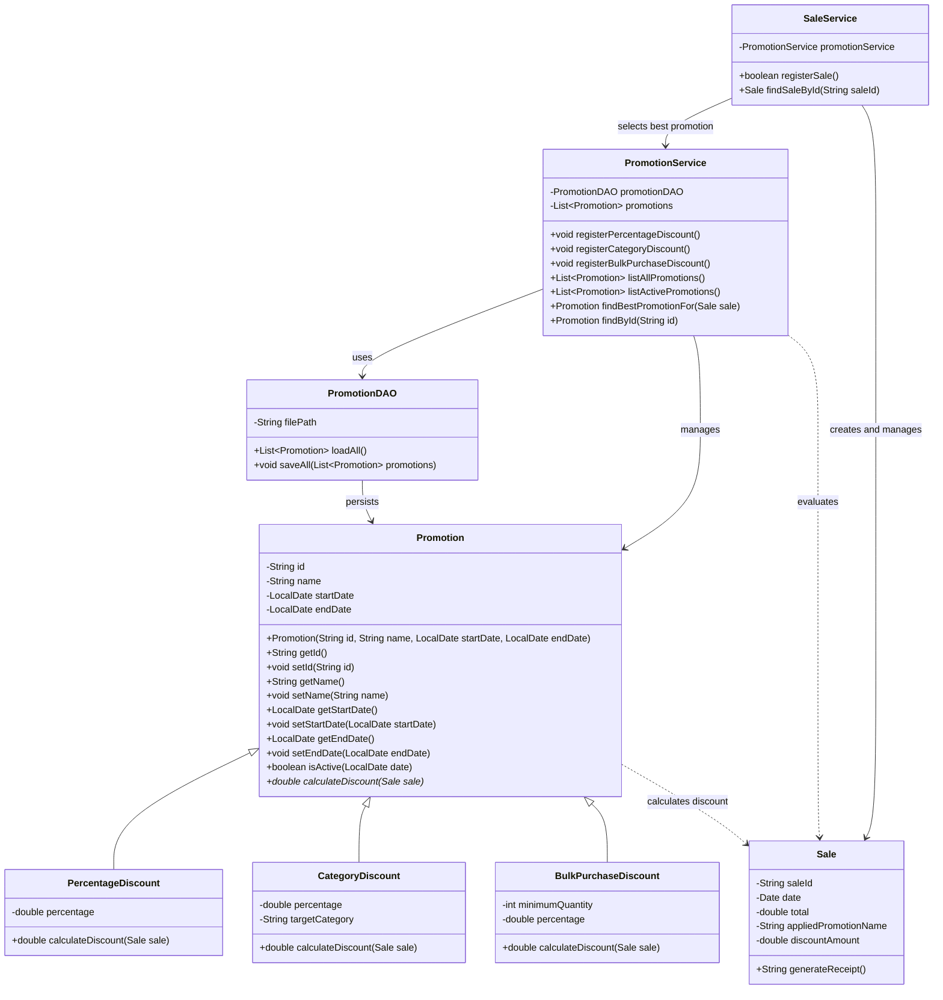

# Promotion Module Class Diagram

The following class diagram represents the integration of the promotion module with the existing GameZone system.

## Main Relationships

- `PercentageDiscount`, `CategoryDiscount`, and `BulkPurchaseDiscount` inherit from the abstract `Promotion` class.
- Each promotion implements its own discount calculation through polymorphism.
- `PromotionDAO` handles promotion persistence.
- `PromotionService` manages promotions and determines the best active promotion for a sale.
- `SaleService` uses `PromotionService` when registering a sale.
- `Sale` stores the applied promotion name and discount amount.
