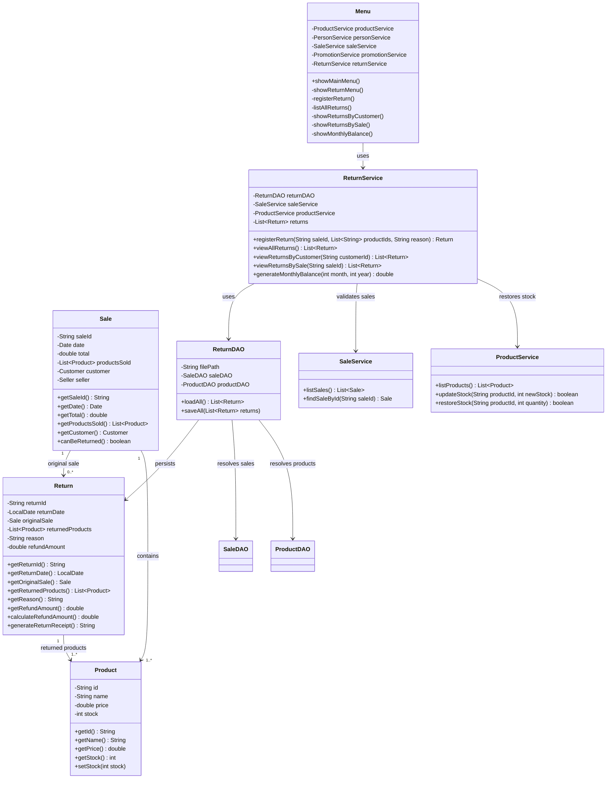

# Return Module Class Diagram

```mermaid
classDiagram

    class Product {
        -String id
        -String name
        -double price
        -int stock
        +getId() String
        +getName() String
        +getPrice() double
        +getStock() int
        +setStock(int stock)
    }

    class Sale {
        -String saleId
        -Date date
        -double total
        -List~Product~ productsSold
        -Customer customer
        -Seller seller
        +getSaleId() String
        +getDate() Date
        +getTotal() double
        +getProductsSold() List~Product~
        +getCustomer() Customer
        +canBeReturned() boolean
    }

    class Return {
        -String returnId
        -LocalDate returnDate
        -Sale originalSale
        -List~Product~ returnedProducts
        -String reason
        -double refundAmount
        +getReturnId() String
        +getReturnDate() LocalDate
        +getOriginalSale() Sale
        +getReturnedProducts() List~Product~
        +getReason() String
        +getRefundAmount() double
        +calculateRefundAmount() double
        +generateReturnReceipt() String
    }

    class ReturnDAO {
        -String filePath
        -SaleDAO saleDAO
        -ProductDAO productDAO
        +loadAll() List~Return~
        +saveAll(List~Return~ returns)
    }

    class ReturnService {
        -ReturnDAO returnDAO
        -SaleService saleService
        -ProductService productService
        -List~Return~ returns
        +registerReturn(String saleId, List~String~ productIds, String reason) Return
        +viewAllReturns() List~Return~
        +viewReturnsByCustomer(String customerId) List~Return~
        +viewReturnsBySale(String saleId) List~Return~
        +generateMonthlyBalance(int month, int year) double
    }

    class ProductService {
        +listProducts() List~Product~
        +updateStock(String productId, int newStock) boolean
        +restoreStock(String productId, int quantity) boolean
    }

    class SaleService {
        +listSales() List~Sale~
        +findSaleById(String saleId) Sale
    }

    class Menu {
        -ProductService productService
        -PersonService personService
        -SaleService saleService
        -PromotionService promotionService
        -ReturnService returnService
        +showMainMenu()
        -showReturnMenu()
        -registerReturn()
        -listAllReturns()
        -showReturnsByCustomer()
        -showReturnsBySale()
        -showMonthlyBalance()
    }

    Sale "1" --> "0..*" Return : original sale
    Sale "1" --> "1..*" Product : contains
    Return "1" --> "1..*" Product : returned products

    ReturnDAO --> Return : persists
    ReturnDAO --> SaleDAO : resolves sales
    ReturnDAO --> ProductDAO : resolves products

    ReturnService --> ReturnDAO : uses
    ReturnService --> SaleService : validates sales
    ReturnService --> ProductService : restores stock

    Menu --> ReturnService : uses
```
